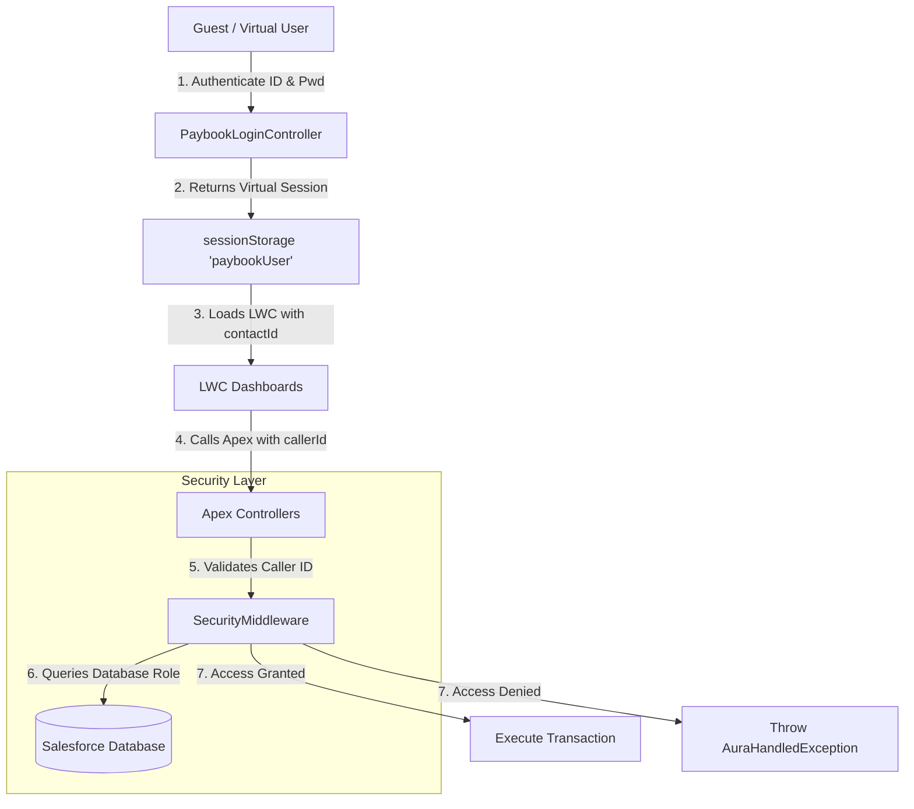

# 🌴 WorkSync - Leave & Hardware Management Portal

Welcome to **WorkSync**—a modern, high-fidelity Employee Self-Service portal built natively on the Salesforce platform using high-performance **Lightning Web Components (LWC)** and a secure **Apex backend**.

Designed for enterprise-level operations, this portal streamlines employee leave planning, automates hardware request workflows, resolves hardware tickets, and enforces high-security server-side checks.

---

## 🛠️ Complete Feature Directory

### 1. 🎫 End-to-End Hardware Ticketing & Support System (Core Module)
WorkSync includes an enterprise-grade hardware ticketing module designed to bridge the gap between employee hardware issues, technical system administration, and HR provisioning.
* **Employee Ticketing Portal:** Employees can raise support tickets for any of their assigned hardware items (e.g., Laptops, Monitors, Keyboards) by entering details about issues, malfunctions, or damage.
* **Technical System Admin (TSA) Control Hub:** Dedicated TSA queues collect and segment tickets. TSAs have special access rights to triage, add remarks, and resolve tickets.
* **One-Click Ticket-to-Request Conversion:** If a ticket represents a hardware failure that requires replacement, TSAs or Admins can trigger a modal that automatically converts the support ticket into a formal **Hardware Request** forwarded directly to HR with a single click.
  * The system copies description text, employee details, and context.
  * It transitions the ticket status to `Resolved (Request Created)` and creates a new hardware request in `Pending HR Approval` status.
* **Outbound Email Alerts:** Changes to ticket status (Triaged, In Progress, Converted, Resolved) trigger automatic transactional email notifications to the employee and TSA.

### 2. 🌴 Comprehensive Leave Management
* **Flexible Leave Types:** Complete support for Annual/Earned, Casual, Sick, Maternity (180 days), Paternity (5 days), Bereavement, and Marriage leave.
* **Smart Validation Engine:** Automatically validates gender constraints (e.g. Maternity for Females), checks for overlapping leave request dates, blocks applications exceeding available balances, and enforces proper notice periods.
* **Leave Auto-Approval Hierarchy:** Implements multi-tier approvals. Managers approve their team's requests, while HR Admins approve managers' requests and can directly assign leaves.
* **Loss of Pay (LOP) Warning System:** Displays real-time warnings to employees if their requested leave duration exceeds their current balance, warning them of LOP salary deductions.

### 3. 🔐 Portal Authentication & Security Middleware
* **Secure Guest Login Suite:** Because the portal is hosted on an Experience Cloud guest site, logins are validated securely via custom Apex password hashing (`SHA-256`) and verification algorithms.
* **Forced Default Password Reset:** Newly created employees are assigned a default credentials pattern and are forced to immediately reset their password upon their first login before they can access any dashboards.
* **Session Integrity & Anti-Privilege Escalation:** Bypasses client-side session modifications (e.g., trying to modify local storage roles to access admin tabs) by re-validating the user's caller ID directly against the Salesforce database on every single server-side operation using `SecurityMiddleware.cls`.

### 4. 📊 HR & Manager Administration Dashboards
* **Employee Roster Management:** HR Admins can create new employees, update details, adjust active statuses, and configure managers.
* **Inventory Allocation Control:** HR and Managers can view employee-wise hardware allocation logs, assign inventory serials, and track fulfillment metrics.
* **Company Policy Circulars:** HR Admins can edit and post official circular policies. Employees are greeted with an HR Circular board stating date, circular ID, and standard policies.

### 5. ✉️ Trigger-Based Automation & Reporting
* **Transactional Email Triggers:** Outbound email triggers alert employees and managers immediately upon critical events (new requests, approvals, ticketing updates, and serial allocations).
* **Automated Monthly Reports:** A scheduled Apex job (`LeaveReportScheduler`) automatically compiles a monthly leave summary CSV and emails it to the HR distribution list.

---

## 🗺️ System Architecture



---

## 🔑 Registered Sign-In Credentials

To test the application locally or inside your staging environment, use the virtual sign-in credentials listed below:

| Role | Employee ID | Default Password | Name |
| :--- | :--- | :--- | :--- |
| **HR Admin** | `CT50` | `Welcome@HR50` | Aleena Mathews |
| **Manager** | `CT01` | `Welcome@Manager01` | John Kumar |
| **Employee** | `CT432` | `WELCOME@ajayCreation12` | Sam |
| **System Admin (TSA)** | `CT101` | `WELCOME@ajayCreation12` | JackSparrow |

---

## 🛠️ Deploying & Configuring the Project

Follow these steps to deploy the portal metadata and establish guest permissions in your Salesforce sandbox or Developer Edition org.

### Step 1: Deploy Metadata
Deploy the Apex controllers, triggers, Custom Objects, and Lightning Web Components using the Salesforce CLI:
```powershell
sf project deploy start
```

### Step 2: Grant Guest Profile Permissions
Because the virtual login page executes within the Experience Cloud **Guest User** context, the guest profile must have explicit access to the portal Apex classes:
1. Run the utility Apex script to automatically create `SetupEntityAccess` records:
   ```powershell
   sf apex run --file "grant_guest_access.apex"
   ```
2. Alternatively, navigate to **Setup** > **Digital Experiences** > **Pages** > Click **Leave_app** > Open the **Guest User Profile** and add the following classes to **Enabled Apex Class Access**:
   * `PaybookLoginController`
   * `PaybookSignupController`
   * `LeaveController`
   * `HardwareController`
   * `SecurityMiddleware`

---

## 🧑‍💻 Component Architecture

* **`paybookApp`**: Parent shell that manages login state, routing, and renders dashboards.
* **`paybookLogin`**: Renders the login form, handles password changes, OTP resets, and new registration.
* **`leaveEmployeeDashboard`**: Self-service portal for applying leaves, checking balances, raising hardware tickets, and checking statuses.
* **`leaveManagerDashboard`**: Manager view for reviewing leaves, approving/rejecting team requests, and tracking team attendance.
* **`leaveHRDashboard`**: HR view for marking leave, reviewing logs, checking analytics, updating roles, and processing hardware queues.
* **`hardwareAdminDashboard`**: Admin portal to update hardware status, assign serials, manage inventory, and convert issue tickets.
